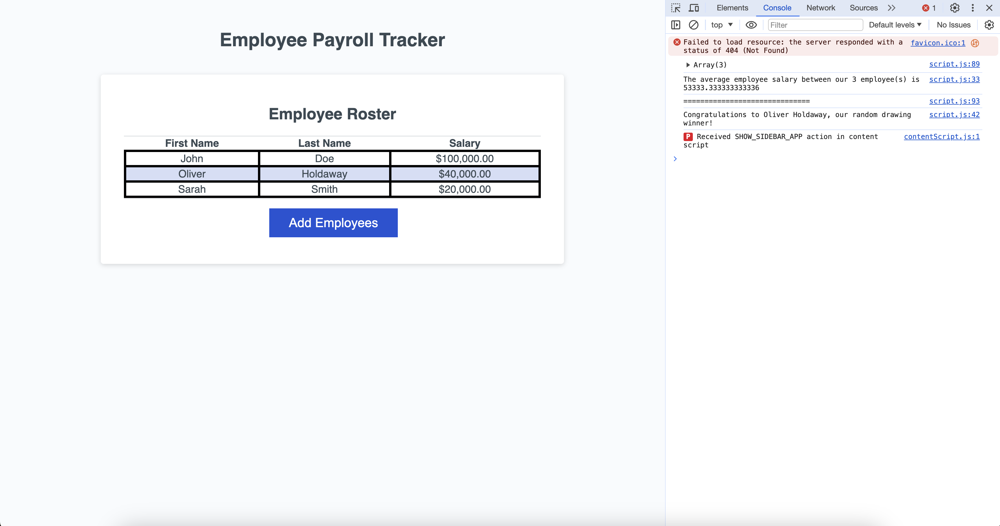

# JavaScript: Employee Payroll Tracker

## Description
The Payroll Manager system is a software tool designed to accept and store employee information, including first name, last name, and salary values. It facilitates the addition of multiple employees to the system. Upon completion, the system calculates the average salary of all employees and selects a random employee. It also provides a complete list of employees, sorted alphabetically by last name.

## Installation 
1. Clone the repository using the SSH key on your local machine with the command `git clone`, followed by the link provided by GitHub
2. Pull the project using the command `git pull`
3. Open the file index.html in your default browser.

## Usage
1. Open index.html in the default browser to view the website properly.
2. Add employee information (First name, last name, and salary) in the prompt area.
3. If you want to add more than 1 employee, continue with the process until reaching the desired amount.
4. Once finished, click 'CANCEL' in the confirmation area.
5. Open DevOps and go to the console tab.

It should resemble the image below.
  
  

## Credits
[freeCodeCamp | JavaScript Array of Objects Tutorial](https://www.freecodecamp.org/news/javascript-array-of-objects-tutorial-how-to-create-update-and-loop-through-objects-using-js-array-methods/)

[StackOverflow | How to handle the end of javascript while loop](https://stackoverflow.com/questions/52884294/how-to-handle-the-end-of-javascript-while-loop)

[Geeks for geeks | Convert a String to an Integer in JavaScript](https://www.geeksforgeeks.org/convert-a-string-to-an-integer-in-javascript/)

[StackOverflow | JavaScript: Get average object in array?](https://stackoverflow.com/questions/50288342/javascript-get-average-object-in-array)

[MDN | Math.random()](https://developer.mozilla.org/en-US/docs/Web/JavaScript/Reference/Global_Objects/Math/random)

## License
This portfolio is open-source and available under the MIT License.

